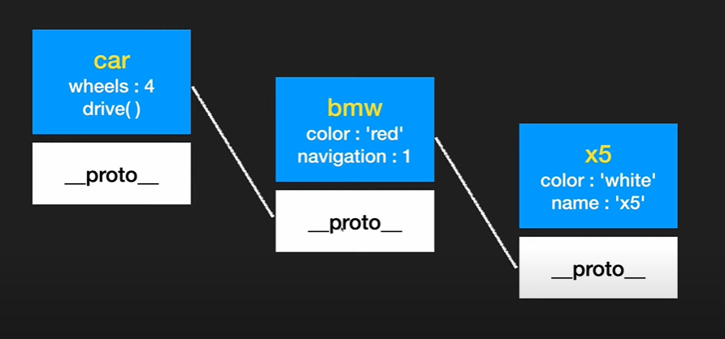

# Javascript

- var, let, const의 차이

var는 선언한 후 다시 선언할 수 있다.

var는 선언하기 전에 사용할 수 있다. 

변수는 컴파일 단계에서 최상위로 끌어 올린 것 처럼 선언을 하는데(호이스팅), const와 let은 temporal dead zone에서 사용할 수 없도록 하는데, 이는

```javascript
let age = 30;
function showAge() {
    console.log(age);
    
    let age = 20;
}

showAge();
```

위와 같은 상태에서 console.log 부분에서 tdz에 걸리게 된다.


const, let은 블록 스코프 변수이지만 var는 함수 스코프 변수이다.

```javascript
const age = 30;
if (age > 20) {
    var text = "adult";
}

console.log(text) // "adult"
```


- 생성자 함수

```javascript
function User(name, age) {
	// new를 붙이면 //부분이 실행됨
    
	// this = {}

    this.name = name;
    this.age = age;
    this.sayName = function(){
    	console.log(this.name)
    }
    
    // return this
}

let user1 = new User("Mandu", 27);

console.log(user1); // User {name: "Mandu", age: "27"}
user1.sayName(); // "Mandu"
```


- computed property

```javascript
let a = 'age';

const user = {
    name: "Mandu",
    [a]: 27
}

console.log(user) // {name: "Mandu", age: 27}
```


- Object helper methods

```javascript
const user = {
    name: "Mandu",
    age: 27
}

let newUser = user // 절대 안됨. call by reference! 조심.

// 이렇게 하자

let newUser = Object.assign({}, user)
// different reference value
```

위 처럼 Object.assign() 과 같이 `assign`, `values`, `entries`, `fromEntries`, `keys` 와 같은 메소드가 존재한다.


- Symbol

Number, String, undefined, null, bool, `Symbol`

```javascript
const id = Symbol('id')

const id2 = Symbol('id')
// Symbol은 유일성을 보장한다.

id === id2 // false
id == id2 // false

const user = {
    name: "Mandu",
    age: 27,
    [id]: "dev"
};

console.log(Object.keys(user)) // Symbol key는 은닉된다.

// 그렇다고 무조건 숨길 수는 없음.
Object.getOwnPropertySymbols(user) // 얜 뭐야;;
Reflect.ownKeys(user) // 얜 또 뭐야;; 가 있습니다.😂


let myId = Symbol.for('myId') // 전역 심볼
let myId2 = Symbol.for('myId')

myId === myId2 // true

// 전역 Symbol은 keyFor로 불러올 수 있음

myId.keyFor() // "myId"

// 전역 Symbol이 아닌 경우는 keyFor를 사용할 순 업서!

id.description // "id"
```


- Array helper methods (reduce)

```javascript
let arr = [1,2,3,4,5];

let initialValue = 0;

arr.reduce((prev, cur) => {
	return (prev + cur)
}, initialValue)
```


- 구조 분해 할당 (Destructuring assignment)

```javascript
let users = ['a', 'b', 'c'];

const [user1, user2, user3] = users;
// 같은 코드로는
const user1 = users[0];
const user2 = users[1];
const user3 = users[2];

// 만약 구조분해 할당이 안 된다면?
let [a, b, c] = [1, 2];
console.log(c) // undefined

// 방지하기 위해선!
let [a, b, c=3] = [1, 2];

// 일부 값 무시
let [a, , c] = [1, 2, 3];
console.log(a, c) // 1, 3

// swap
let [a, b] = [b, a];

// Object DA

let user = {name: "Mandu", age: 27};
let {age, name} = user;

// 분해할당 새로운 변수로 할당
let {name: newName, age: newAge} = user;

// default
let {name, age, gender="male"} = user;
```


- Rest parameter, spread syntax

```javascript
function showName(name) {
    console.log(name);
}

showName("Mandu"); // "Mandu"
showName("Mandu", "Dev"); // ?
```

- Arguments
  - 함수로 넘어온 모든 인수에 접근
  - 함수 내에서 이용 가능한 지역 변수
  - length / index
  - Array 형태의 객체
  - 배열의 내장 메소드 못씀!


```javascript
function showName(name) {
    console.log(arguments.length);
    console.log(arguments[0]);
    console.log(arguments[1]);
}

showName("Mandu", "Dev")
// 2
// "Mandu"
// "Dev"

// With rest parameters
function showName(...names) {
    console.log(names);
}

showName("Mandu", "Dev") // ["Mandu", "Dev"]
```


- critical example

```javascript
/*
제공된 값 다 더하기
*/

function add(...numbers) {
    return numbers.reduce((prev, cur) => {return prev + cur}, 0);
}

add(1, 2, 3, 4, 5, 6, 7)
```


```javascript
/*
user 객체를 만들어주는 생성자 함수
*/

function User(name, age, ...skills) {
    this.name = name;
    this.age = age;
    this.skills = skills;
}

const user = new User("Mandu", 27, "React", "Vuejs", "html", "css")
console.log(user) // 예상이 되겠죠?
```


- 전개 구문 (spread syntax) : 배열

```javascript
// array
let arr1 = [1, 2, 3];
let arr2 = [4, 5, 6];
let res = [0, ...arr1, ...arr2, 7, 8]

// obj

let user = {name: "Mandu"};
let newUser = {...user, age: 27};

newUser.name = "Tom";

console.log(user);
console.log(newUser);
// 결과는 다름 !
```


- Closure
  - 함수가 생성될 당시의 외부 변수를 기억.
  - 생성 이후에도 계속 접근 가능.

```javascript
// Lexical Env

function makeCounter() {
  let num = 0;

  return function () {
    return num++;
  }
}

let counter1 = makeCounter()
let counter2 = makeCounter();

console.log(counter1())
console.log(counter1())
console.log(counter1())

console.log(counter2())
console.log(counter2())
console.log(counter2())

// counter1과 counter2가 생성될 때의 closure를 갖고 태어난 함수들. num을 따로 공유한다? 즉, 생성될 당시의 외부 변수를 기억한다
```


- setTimeOut, setInterval

```javascript
setTimeout(function() {
    console.log('Mandu')
}, 0)
console.log("Dev")

//result : "Dev" "Mandu"
```


- call, apply, bind

```javascript
const Mandu = {
  name: "Mandu"
}

const Dev = {
  name: "Dev"
}

function showName() {
  console.log(this.name)
}

showName.call(Mandu)

function update(birthYear, job) {
  this.birthYear = birthYear;
  this.job = job
}

// call과 apply의 차이. arrow function은 안돼!
update.call(Mandu, 1996, "Front-engineer")
update.apply(Dev, [1996, "Front-engineer"])


console.log(Mandu)
console.log(Dev)
```


- critical example

```javascript
const nums = [1,4,2,5,6];

console.log(Math.max(...nums))
console.log(Math.min(...nums))

// 같은 방법!
console.log(Math.max.apply(null, nums))
console.log(Math.min.call(null, ...nums))
```

```javascript
const Mandu = {
  name: "Mandu",
  showName: function() {
    console.log(`hello, ${this.name}.`)
  }
}

Mandu.showName(); // "hello, Mandu."

const fn = Mandu.showName
fn() // "hello, undefined."
fn.call(Mandu) // "hello, Mandu."

const bindFn = fn.bind(Mandu)
bindFn() // "hello, Mandu."
```


- prototype

```javascript
const car = {
  wheels: 4,
  drive() {
    console.log("drive..")
  }
}

const bmw = {
  color: "red",
  navigation: 1,
}

bmw.__proto__ = car

console.log(bmw.wheels) // 4
```



이를 `Prototype chain`라 한다. 이를 더 쉽게 구현하기 위해,

```javascript
function Bmw(color) {
  this.color = color
}

Bmw.prototype.wheels = 4
Bmw.prototype.drive = function() {
  console.log("drive...")
}

const x5 = new Bmw("white")

for (p in x5) {
  if (x5.hasOwnProperty(p)) {
    console.log("o", p)
  } else {
    console.log('x', p)
  }
}
```

이를 더 편하게 하면..

```javascript
function Bmw(color, name) {
  this.color = color;
  this.name = name
}

Bmw.prototype = {
  constructor: Bmw,
  wheels: 4,
  drive() {
    console.log(`${this.name} drive...`)
  },
  navigation: 1,
  stop() {
    console.log(`${this.name} stop!`)
  }
}

const x5 = new Bmw("white", "boongboong")
```

