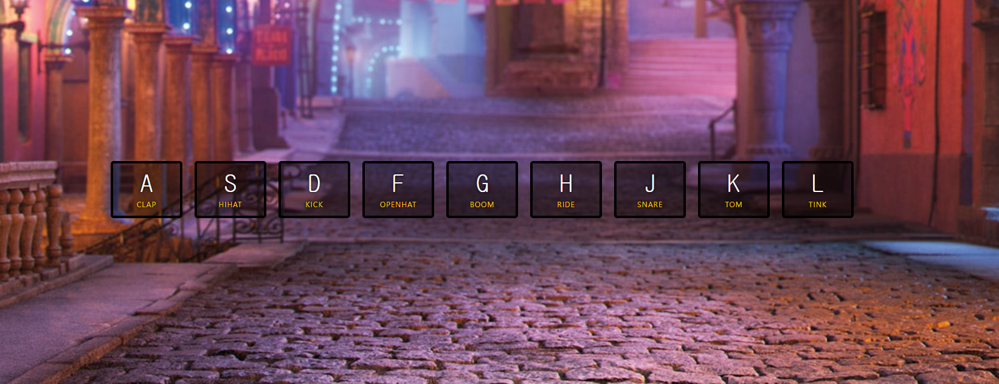

# Day 01

### 드럼 사운드 재생 with vanillaJS


구현:



다음과 같은 화면으로 실행된다. 키보드를 누르면 eventListener가 이를 반응하여 playSound를 실행하고, transform이 끝나면 이를 반응하여 transition의 형태를 바꿔주는 형태로 구현했다.

```javascript
// 대략적인 실행과정
window.addEventListener('keydown', playSound) // 1. window.addEventListner가 키보드의 눌림을 확인하여 playSound를 실행한다.
function playSound(e) {
    const key = document.querySelector(`.key[data-key="${event.keyCode}"]`) // 이렇게도 querySelect가 가능하다는것..!
    key.classList.add('playing')
} // 2. key에 playing이라는 클래스를 추가한다.(소리 재생은 생략)

const keys = document.querySelectorAll('.key')
keys.forEach(key => 
	key.addEventListener('transitionend', removeTransition)
) // 3. transitionend, 즉 트랜지션이 끝난 반응을 받아 removeTransition이라는 메소드를 실행한다.

function removeTransition(e) {
    if (e.propertyName !== 'transform') return;
    this.classList.remove('playing')
} // 4. event의 propertyName은 생각보다 다양하다. 한번의 변화에 property가 몇 개나 변화되는지에 따라 모든 결과가 나온다. 이에 transform의 것만 받아서 classList의 playing클래스를 제거한다. 여기서 this는 key를 가리키는데, this의 정확한 정보는 더 찾아봐야 할 것 같다.
```


추가로, css부분에 playing과 key부분을 추가하면 좋을 것 같아서 readme에 적는다 :smile:

```css
.key {
  transition: all 0.5s ease;
}

.playing {
  transform: scale(1.1);
}

/*
다른건 몰라도 이 부분은 제일 중요할 것 같다.
transition과 transform 결국 사용자의 event에 반응하는 효과들이니 사용할 때 어떤 형태로 사용되고 어떤 방식으로 scale이 변하는지는 필요할 때 마다 document를 참고해야 할 것 같다.
추가로 예전에 사용했던 jquery에서도 비슷하게 슬라이드 하는 형태가 있었는데, 이는 jquery를 보며 다시 확인해보도록 하자.
*/
```


## 배운 점

```javascript
const key = document.querySelector(`.key[data-key="${event.keyCode}"]`)
// 백틱을 사용한 쿼리추출, 굉장히 심플하면서 힙해보인다. (접수)
```

```html
<audio data-key="65" src="./sounds/clap.wav"></audio>
<script>
	const audio = document.querySelector(`audio[data-key="${event.keyCode}"`)
    audio.currentTime = 0 // 이런 형태로 사용하면 소리가 중복되도 실행되게 할 수 있다는 점. (실제로도 킥 소리가 전부 사라지기 전에 다시 킥을 차니까)
    audio.play() // 결국에 소리의 재생은 얘때문에 가능한 것이다.
</script>
```

```javascript
const keys = document.querySelectorAll('.key')
keys.forEach(key => 
	key.addEventListener('transitionend', removeTransition)
) // 제법 성가신 느낌이 드는 코드이다. transition + end 라는 이름.. (접수)
```


해볼만한 것

- 소리의 녹음 / 재생 / 저장 기능을 추가해보면 어떨까 싶다.

